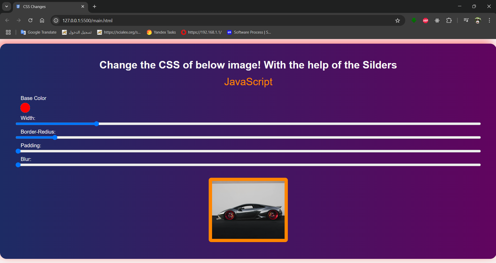

# Dynamic-CSS-Controller
This is a simple interactive web application that allows users to dynamically change the style of an image using HTML sliders and a color picker. The changes are applied using CSS variables and updated in real-time with JavaScript.

## 🚀 Features

- 🎨 Change the **background color** of the image
- 📏 Adjust the **width**, **padding**, and **border-radius**
- 🌀 Apply a **blur** effect
- 🎚️ Real-time updates using input sliders and JavaScript
- 💡 Responsive and visually styled using modern CSS

## 📁 Project Structure

```

project/
│
├── index.html       # Main HTML file
├── main.css         # Styling with CSS variables
├── main.js          # JavaScript for dynamic updates
├── car.jpg          # Image used in the project
└── css.png          # Favicon for the webpage

````

## 🛠️ How It Works

1. HTML provides the structure and input elements (color picker and sliders).
2. CSS uses variables (`--base`, `--width`, `--blur`, etc.) to style the image.
3. JavaScript listens for input changes and updates the corresponding CSS variable in real-time using:

```javascript
document.documentElement.style.setProperty(`--${this.name}`, this.value + suffixDate)
````

## 🌐 Live Demo

You can open `index.html` in any modern web browser to see the project in action.

## 📷 Preview



## ✅ Requirements

* A modern web browser (Chrome, Firefox, Edge, etc.)
* No external libraries needed

## 🧠 Concepts Used

* HTML5 input elements
* CSS Variables (`--var`)
* JavaScript DOM manipulation
* Event listeners
* Real-time UI updates

## 📌 Notes

* Ensure `car.jpg` and `css.png` are in the correct path or update the source in the HTML.

## 📄 License

This project is open-source and free to use for educational purposes.

```# Dynamic-CSS-Controller
# Dynamic-CSS-Controller
